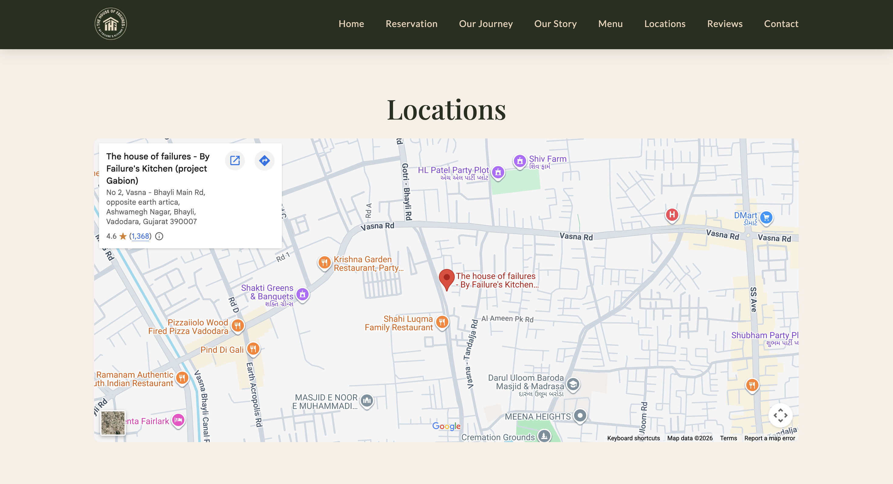
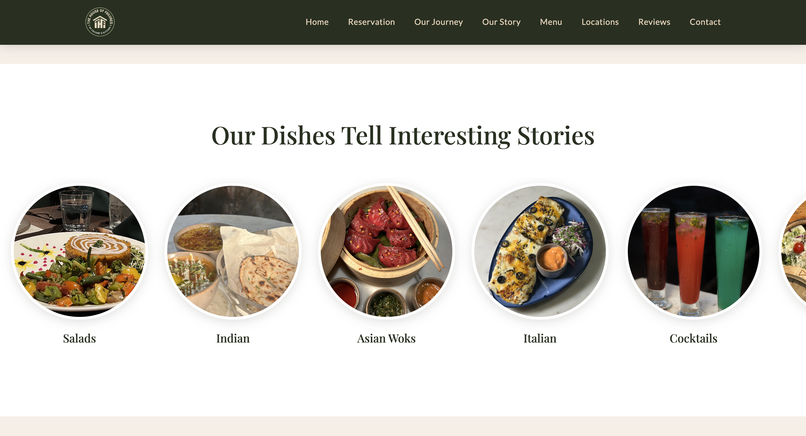
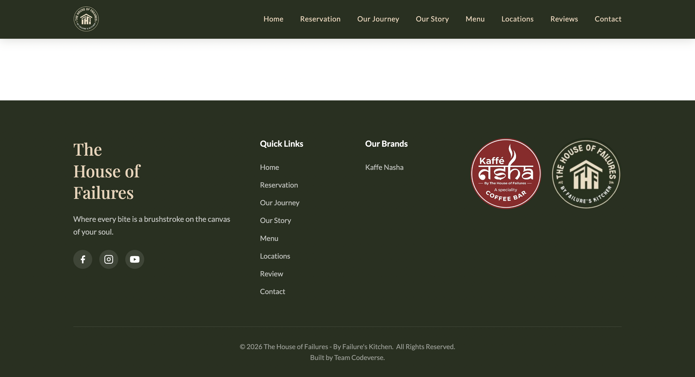

# 🍽️ The House of Failures

A modern and responsive restaurant website developed for a real client to establish a strong online presence and provide customers with an engaging digital experience.

## 🌐 Live Website

https://thehouseoffailures.com

---

## 📖 Project Overview

The House of Failures is a restaurant website designed to showcase the restaurant's ambiance, menu, gallery, location, and contact information in an attractive and user-friendly manner.

The website focuses on delivering a seamless browsing experience across all devices while maintaining a visually appealing design that reflects the restaurant's brand and atmosphere.

---

## ✨ Key Features

* 📱 Fully Responsive Design
* 💫 Smooth Animations and Interactive Elements
* 🍽️ Restaurant Menu Showcase
* 📸 Image Gallery
* 🪑 Table Booking via WhatsApp
* 🗺️ Google Maps Integration
* 📞 Contact Information Section
* ⚡ Fast and Optimized User Experience

---

## 🛠️ Technologies Used

* HTML5
* CSS3
* JavaScript (ES6)
* Git
* GitHub
* Hostinger

---

## 👨‍💻 My Role

As the developer of this project, I was responsible for:

* Frontend Development
* Responsive Web Design
* UI Implementation
* Website Optimization
* Git & GitHub Version Control
* Deployment and Hosting Support
* Communicator

---

## 🎯 Project Goals

* Create a professional online presence for the restaurant
* Improve customer engagement through a modern website
* Provide quick access to menu, gallery, and booking information
* Ensure a smooth experience across mobile, tablet, and desktop devices

---

## 📸 Screenshots

'for more screenshots, visit screenshots folder or visit the website link given below'

---

## 🔗 Visit the Website

https://thehouseoffailures.com

---

## ☎️ Contact Me

Name : Aayush Panchal

E-Mail : panchalaayush1511@gmail.com

LinkedIN : https://www.linkedin.com/in/aayush-panchal-36742122b/

## 📝 Note

This repository serves as a project showcase and portfolio case study. The source code is maintained privately and is not included in this repository.
